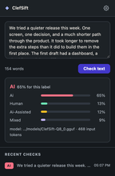
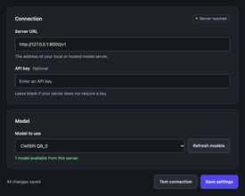

# ClefSift

ClefSift pairs a Chrome extension with a fine-tuned [Clef 27B](https://huggingface.co/Cloudflare/clef) decision model.
It classifies text as human, AI-assisted, mixed, or AI-generated.

The extension checks selected text, pages, and pasted text.
Optional LinkedIn scanning adds feed badges and can dim AI or AI-assisted posts.

**Results indicate writing patterns. They do not prove authorship.**
Independent professional-post accuracy remains untested.

| LinkedIn feed | Text check | Local model |
|:---:|:---:|:---:|
| [](assets/screenshots/feed.png) | [](assets/screenshots/text-check.png) | [](assets/screenshots/settings.png) |

Demonstration screens use fictional profiles. Example verdicts do not establish accuracy.

## Use the extension

1. Clone this repo:

   ```bash
   git clone https://github.com/spmurrayzzz/clefsift.git
   cd clefsift
   ```

2. Open `chrome://extensions` and enable **Developer mode**.
3. Select **Load unpacked**, then select `extension/`.
4. Open ClefSift settings and enter your server URL, such as `http://127.0.0.1:8000/v1`.
5. Select **Connect server** and approve origin access.
6. Select the server model, save the settings, then select **Test connection**.

The server must support `POST /v1/systemone`. A chat-completions API alone does not meet this requirement.
The API key is optional when the server permits requests without a key.

Model card and weights: [spmurrayzzz/clefsift on Hugging Face](https://huggingface.co/spmurrayzzz/clefsift).
The weight upload is in progress. Check the model repo for download status.
Follow the [local serving guide](docs/serving.md) after the files arrive.
Weights stay outside Git. You can also use an existing compatible server.

To try the interface without a model, run:

```bash
python3 tools/mock_server.py
```

Use `http://localhost:8787/v1`, key `test-key`, and model `mock-clef`.
The mock returns synthetic results. It does not detect AI text.

## Train your model

[Training](docs/training.md) covers source preparation, controlled edits, four-class assembly, reference training, and evaluation.
[Export and serving](docs/serving.md) covers GGUF conversion and Q8 comparison.

The tools preserve source groups and explicit splits.
They measure complete requests, reject truncation, and select checkpoints before held-out scoring.
Generation and training require explicit resource limits.

This release contains code, configuration, and text-free source locators.
It excludes corpus text, generated examples, checkpoints, and weights.
The process is repeatable, but different generators and environments can change the results.

## Results

The selected v2 reference scored 169/188 on matched validation and 162/188 on a held-out Luna version.
Its Q8 export retained 525/526 class predictions across three validation panels.
These panels share source groups and controls. They are not independent benchmarks.

See [results and limits](docs/results.md) before you interpret these figures.

## Repo

| Path | Contents |
|---|---|
| `extension/` | Manifest V3 extension, with no dependencies or build step |
| `finetune/` | Preparation, generation, training, and evaluation tools |
| `tools/mock_server.py` | Local interface demonstration |
| `docs/` | [Extension and privacy](docs/extension.md), [training](docs/training.md), [serving](docs/serving.md), [results](docs/results.md) |

## License

[Apache-2.0](LICENSE). Copyright 2026 spmurrayzzz.

Training uses the Apache-2.0 [clef-finetune](https://github.com/MersivMedia/clef-finetune) toolkit and Cloudflare Clef.
These dependencies retain their own licenses. This project is not affiliated with Cloudflare or Mersiv Media.
Dataset license declarations do not establish rights in each source text.
